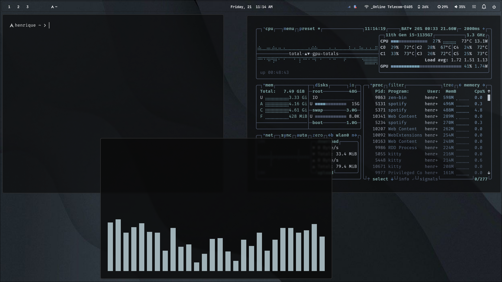

# 🚀 Dotfiles — Setup Hyprland • Arch Linux

This repository contains my **personal dotfiles**,

configured for a minimalist environment using **Arch Linux + Hyprland**.

---

## Technologies & Tools

- **Hyprland**
- **Waybar**
- **Vicinae** (app launcher)
- **Neovim** (custom configuration)
- **Kitty**
- **[Lvsk-calendar](https://github.com/Gianluska/lvsk-calendar)** (terminal calendar) 
- **Zsh**
- **Swaync** (notification center)
- **Impala** (wifi tui)
- **Battop** (battery tui)
- **Btop**
- **Wlogout**
- **Hyprlock / Hypridle / Hyprshot / Hyprpicker** – lockscreen,idle management, screenshort, color picker
- **Fastfetch** – system information display
- Other scripts and configs from `~/.config`

### 📌 Note

These dotfiles are custom-made for my environment.
Feel free to adapt, improve, and use them as a basis for your own setup.
